# Implemented features
### 1. Customer Features

The customer interface provides a personalized shopping experience, allowing users to manage their lifecycle from discovery to delivery.

- Profile Management: Enables customers to view and update personal data including name, email, phone number, and shipping address.

- Advanced Book Search: Features a multi-layered search tool to find books by:

    - ISBN: Precise lookup for a specific title.

    - Category: Thematic filtering (Science, Art, Religion, History, Geography).

- Shopping Cart System: A dynamic interface where users can add multiple books, adjust quantities, and view a real-time total price calculation.

- Checkout & Payment: A secure process that finalizes orders, calculates the grand total, and initiates stock updates.

- Order History Tracking: Provides a transparent view of all past purchases, including order numbers, dates, and total costs.

### 2. Administrative Features

The administrative dashboard offers comprehensive control over the store’s inventory and financial performance.

- Inventory Control:

    - Add New Books: Seamlessly register new titles with metadata (Authors, Publisher, ISBN, Category).

    - Modify Records: Edit existing book prices, titles, and inventory thresholds to match market demand.

- Supply Chain Management:

    - Admin Orders View: A log to track all restock orders triggered by low inventory.

    - Confirmation of Receipt: Admins can manually confirm shipments from publishers, which automatically updates the system's stock levels.

- System Reports & Analytics:

    - Monthly Sales: Total revenue generated during the previous month.

    - Daily Sales Performance: Revenue tracking for any specific user-selected date.

    - Customer Insights: Highlighting the Top 5 customers based on total spending.

    - Popularity Trends: Identifying the Top 10 selling books over the last three months.

    - Replenishment Analytics: Data on how many times specific titles have been restocked.

### 3. Automated System Logic (Triggers)

The backend utilizes database triggers to ensure the system remains self-sufficient and data-accurate without constant manual oversight.

- Automatic Restocking (AutoRestock): When a book's stock quantity falls below its predefined threshold after a sale, the system automatically creates a "Pending" order in the admin dashboard for replenishment.

- Negative Stock Protection (PreventNegativeStock): A critical safety constraint that blocks any transaction—whether a sale or a manual update—that would result in a negative stock count.

- Integrity Enforcement: Use of ON UPDATE CASCADE and ON DELETE CASCADE to maintain perfect synchronization between publishers, authors, and book records.

# ER Diagram
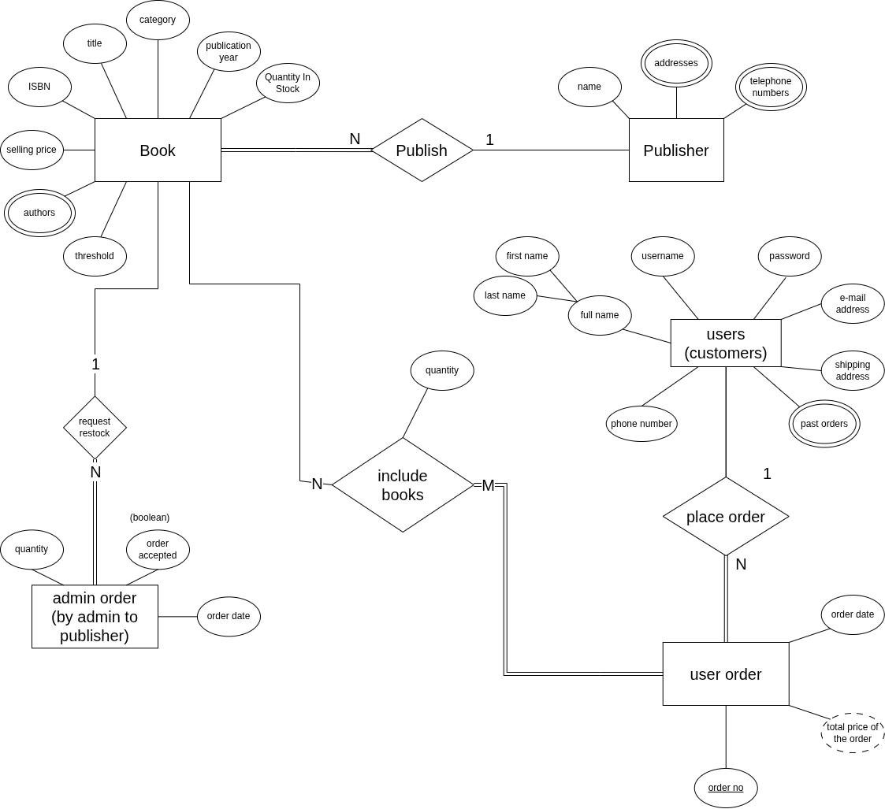

# Relational Schema
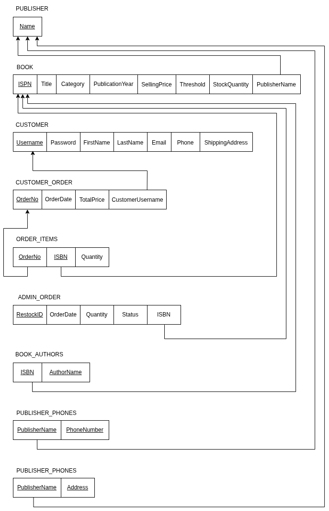

# Description of the logic of each user interface screen
## Login Page
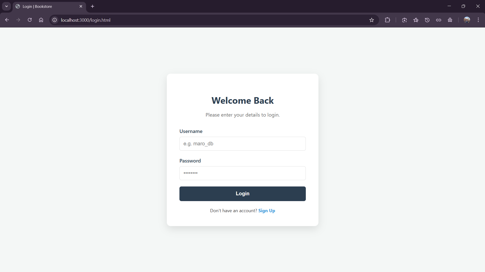
1. Login & Registration Screen (login.html)

    Login Logic:

        Captures user credentials (username/password) and sends a POST request to the /login endpoint.

        If successful, it stores the user's information and username in localStorage to maintain the session.

        Redirects the user to the admin_dashboard.html if they are an "Admin" or to dashboard.html for regular customers.

    Registration Logic:

        Gathers personal details including username, password, email, and shipping address.

        Sends a POST request to /register.

        Upon successful registration, it alerts the user and switches the view back to the login form.

## Customer Pages
### Browse Books
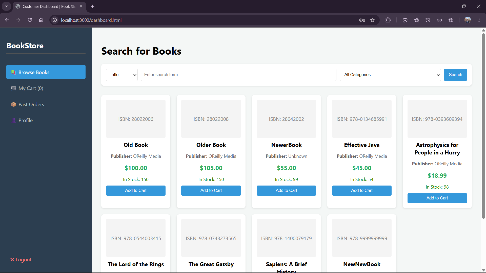
2. Book Search (dashboard.html, search.js, book_manipulation.js)

    Search & Browse Logic:

        Users can search for books by ISBN, title, author, or publisher using a dropdown filter and text input.

        The frontend sends a GET request to specialized backend routes (e.g., /books/search/title/:title).

        Results are dynamically rendered as "book cards" showing the title, price, and stock status.

    Category Filtering: Users can filter the catalog by specific categories (e.g., Science, Art, History), which triggers a request to /books/category/:category.
### Shopping Cart
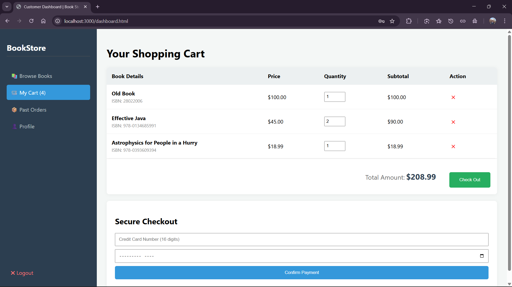
3. Shopping Cart & Checkout (cart.js)

    Cart Management:

        Adds books to a local cartData array stored in localStorage to persist across refreshes.

        Calculates the grand total and total item count dynamically as users update quantities or remove items.

    Checkout Logic:

        Requires a credit card number and expiry date.

        Sends the cart contents and payment info to the /checkout endpoint via a POST request.

        Upon success, the cart is cleared from localStorage, and the user is redirected to their order history.
### Profile Page
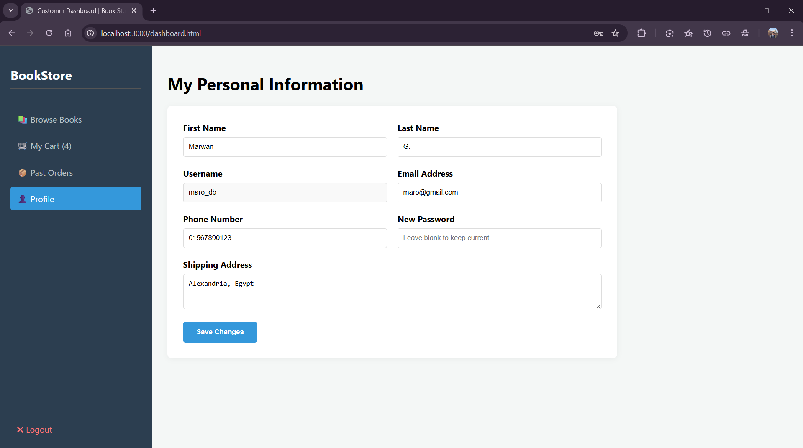
4. User Profile Screen (profile.js)

    Data Loading: Automatically populates the profile form by parsing the user information stored in localStorage upon login.

    Update Logic:

        Allows users to edit their name, email, phone, and address.

        Sends a PUT request to /customer/profile.

        If successful, it merges the new data into localStorage so the UI reflects changes immediately without a re-login.
### Order History
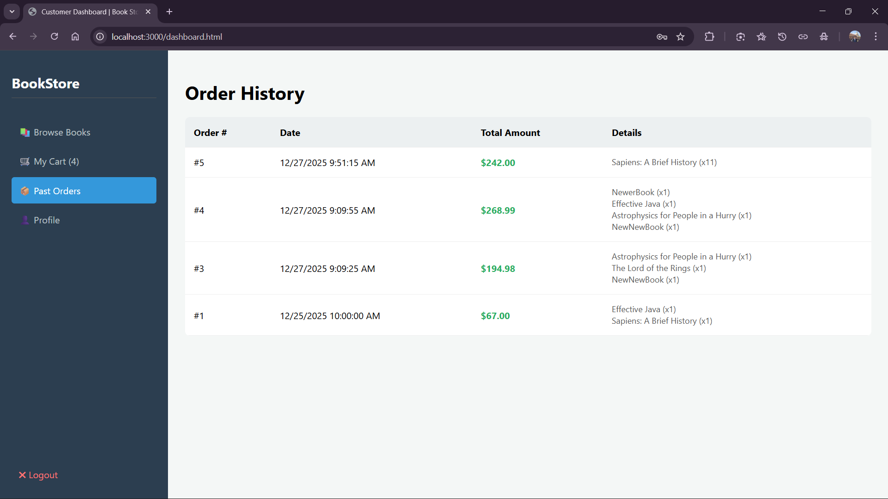
5. Order History Screen (order-history.js)

    Logic:

        Fetches all past orders for the logged-in user from /orders/history/:username.

        Iterates through the retrieved orders to display the order number, date, total price, and a detailed summary of the items purchased in each transaction.

## Admin Pages
### Admin Browse Books
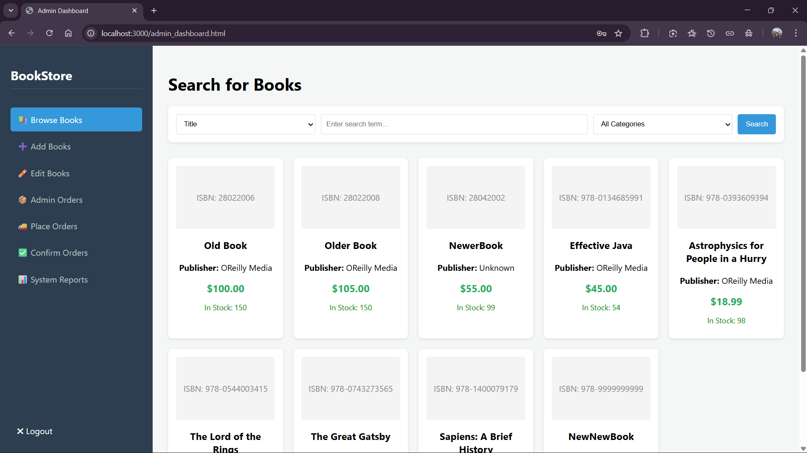
### Admin Add Books
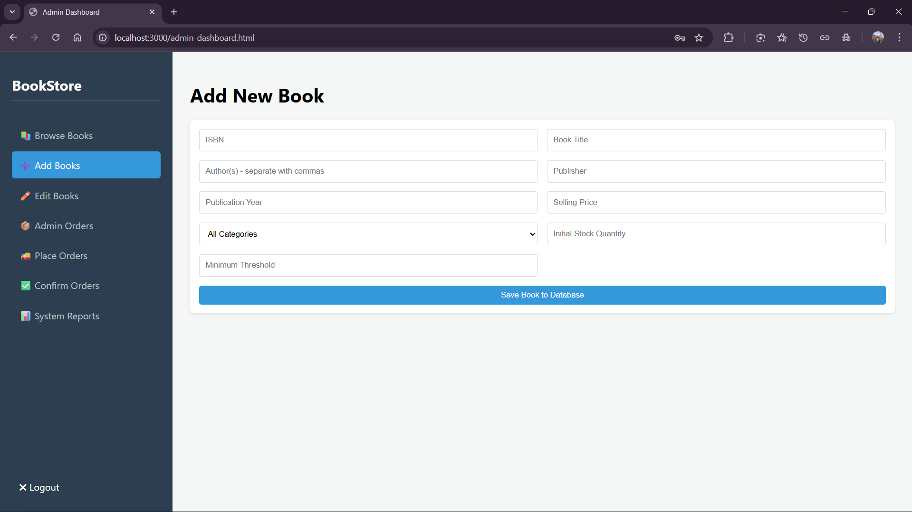
### Admin Edit Books
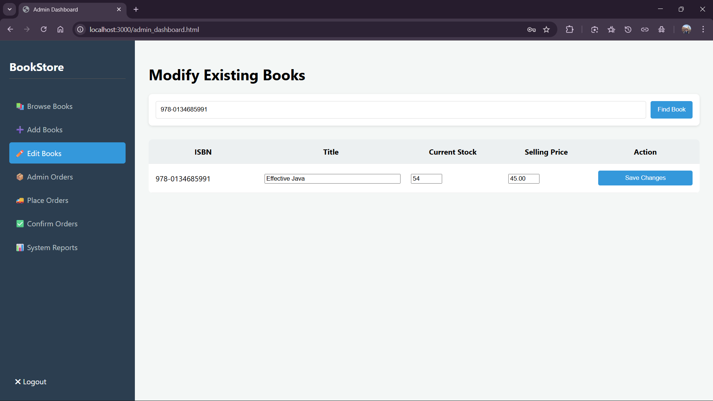

6. Admin: Book Management (book_manipulation.js, search.js)

    Add Books: Captures full book metadata, including multiple authors (split by commas), and sends it to the backend.

    Edit Books:

        Admins search for a book by ISBN to load its current details into an editable table row.

        Logic allows for updating the Title, Stock Quantity, and Price via a PUT request to /books/:isbn.
### Admin Orders Page
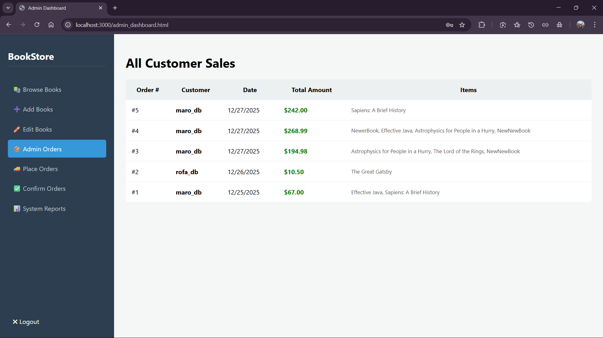
### Admin Confirm Orders
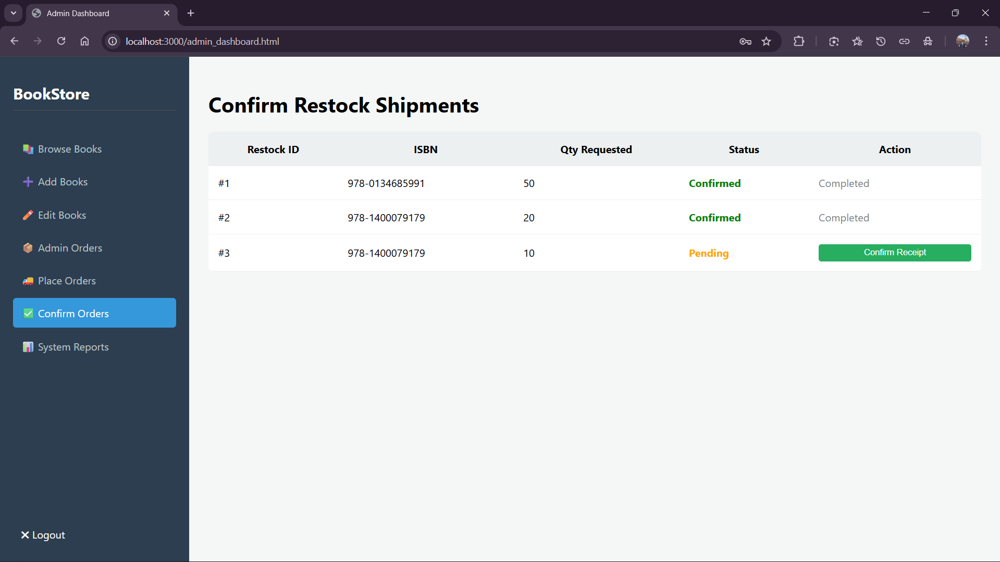
7. Admin: Order & Inventory Management (place_orders.js, admin_orders.js)

    Restock Suggestions (place_orders.js): Fetches a list of books where current stock is below the defined threshold from /books/low-stock.

    Placing Orders: Admins can click "Place Order" to notify publishers, which sends a POST request to /admin/orders/place.

    Confirming Receipts:

        Displays all pending restock requests.

        Clicking "Confirm Receipt" sends a POST request to /admin/orders/confirm/:restockId, which triggers a database update to increase the book's stock.
### Admin System Reports
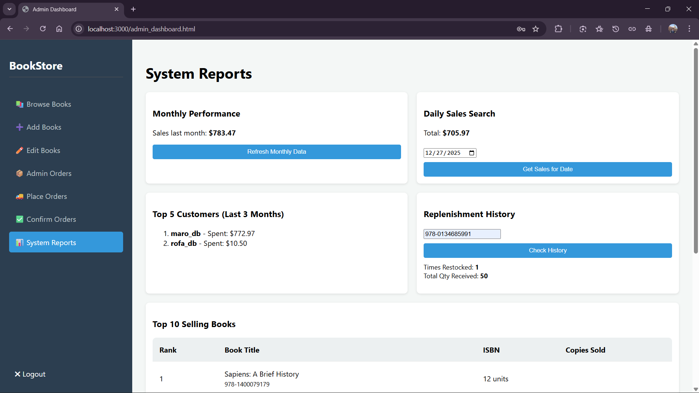
8. Admin: System Reports (system_reports.js)

    Sales Tracking: Logic fetches and displays total sales for the previous month and allows admins to query sales for a specific date.

    Analytics: Automatically loads lists of the "Top 5 Customers" and "Top 10 Selling Books" for the last three months upon opening the reports section.

